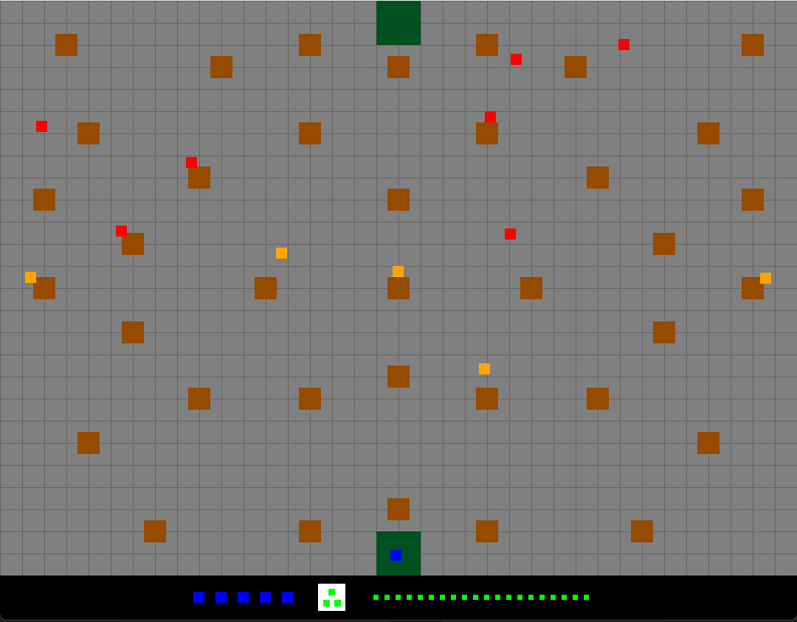

# Paintball
The goal of this project was to create a fast-paced arcade style shooter game which has the player face off against progressively harder waves of enemies as they advance levels. The Modular/Utility AI component was used to dynamically generate and select enemy cover positions from the player, determine when they should shoot at player, and whether they should retreat to reload if they are low on ammo. 
## Game Design
This project was designed to play fairly straight forward and be easy to pick up and play. It should also be fairly easy to  understand the decision-making calculations and game actions taking place. The game takes place in a pre-defined rectangular area and contains five main game entities:
- Player: The blue square controlled by player with mouse/keyboard input
- Enemies: The red and orange squares controlled by the Modular AI system
- Bullets: The small green squares that represent projectiles fired by enemies and the player
- Cover: The brown squares scattered throughout the map that bullets cannot pass through
- Reload Points: The two dark green squares that will replenish enemy or player ammo

The goal of the game is for the player to defeat all opposing enemies and complete the 4 available levels without dying. More enemies are spawned for the player to defeat as the levels progress. The first level only contains one enemy and is used more as an observational level to see enemy behavior.
There exists a Game class Singleton which holds information about the game state. When passed the time between game frames (deltaTSec) from the game while loop running in the main function, it “ticks” all appropriate game entities to update them. SDL graphics are then rendered every game frame to draw the game entities and UI. I decided to have the Game Singleton “tick” the player, enemies, and bullets twice per frame since there were instances where the bullets would move through an enemy or cover without a hit being registered. Having the movements and hit detections occur more frequently solved this problem.
At the start of every level the player has 5 lives and the enemies have 1. Each time a player/enemy is hit by a bullet they lose one life (enemy dies). Cover can be used to hide from enemy fire as it will absorb any bullets that hit it. The player and enemies also start with 20 ammo which can be used for both weapon types in the game, the rifle and the shotgun. The rifle has a longer range and faster bullet/reload speed while the shotgun has a shorter range and slower bullet/reload speed. When firing a rifle one bullet is used however, a shotgun uses 3 bullets and shoots one straight at the target and two offset by 10 degrees to either side of the target. If a shotgun is fired close enough to the target it is possible that multiple bullets will hit the target, dealing one damage each. When the player or enemies run out of ammo they can reload by traveling over one of the two reload points on the top and bottom of the screen. While the player has access to both the rifle and shotgun, enemies only have one which is indicated by their color. Red enemies have rifles and orange enemies have shotguns.
The goal of the gameplay was to create a fast-paced game where the player will always be moving and dodging. The enemies are designed to continuously approach the player so if the player stays in one place and tries to wait for the enemies to come to them before taking them out, it is likely that they will be overwhelmed. The player should move strategically between cover and pop out briefly to shoot at enemies before finding cover again. If the player blindly runs into the middle of the arena they will quickly be killed, especially in the higher levels. The gameplay is simple enough to be easily picked up yet still interesting enough to give the player a challenge, especially in the final level.
## Controls/UI
The game is controlled using the mouse and keyboard and utilizes the built in SDL event handling. During each game tick each SDL event is processed and passed to the Controller_UI class to identify the input and call for the necessary updates to be made to the player character. The player can move their character using the WASD keys or the arrow keys. The player can aim with the mouse and shoot by left clicking. The mouse coordinates are used to determine the direction vector relative to the player that they are shooting and a new bullet, or bullets if using the shotgun, is created and fired in that direction. The player can also change weapons between the rifle and shotgun using the E key.
The player UI is located at the bottom of the screen and has information regarding their current health, equipped weapon, and their ammo amount. Going from left to right, you first have the player’s health which is represented by a blue square for each life. Next is the equipped weapon indicator. One green bullet represents the rifle is equipped and three green bullets in a triangle represent the shotgun is equipped. Finally, is the ammo indicator. Each small green bullet represents one ammo. All of these UI elements update immediately, as appropriate, to represent the current game state.
When the player dies or beats all the levels the game will print a game over message to the terminal and show the player score (# of enemies defeated).
## Modular AI
To control enemy behavior, a simple modular AI system was created to evaluate the viability of each enemy action based on the game conditions at the time of assessment. Though I had a few additional ideas I was working on that didn’t make the final version of the game, it was ultimately decided that the enemies would choose between advancing towards the player, shooting at the player, and retreating to a reload point to replenish their ammo. All the modular AI classes and pieces are located in the ModularAI folder of the project code.
To build this AI system I started by defining the FloatFunctor class to serve as the parent class for all float functors, considerations, and aggregators that I implemented. This was simply a generic C++ functor class that has only an “operator” method. This allowed each child class to be self-contained as they only contain the logic to perform a single operation or evaluation and return a float. Several consideration classes were made to consider different aspects of the decision making process and then aggregator classes were made to combine multiple considerations together. The aggregators use the float output of each consideration in some way to produce a single float value which severed as the primary assessment of the utility of the action that the aggregator was designed for.
The ActionOption class was created to serve as the parent class of the 3 child classes representing each available option the enemy can choose from. These classes use considerations and aggregators to evaluate the utility rating of an action and in the instance of moving to cover and moving to a reload point, they have additional methods to return the cover and reload point positions. These classes are instantiated in the evaluateOptions() method of enemy entities (in Enemy.cpp) to evaluate the potential actions every 1 second of game time. I will break down each ActionOption and the considerations it uses to evaluate the action.
The first ActionOption is MoveToCover which considers all possible cover points and finds the cover position with the highest utility evaluation. This class stores the utility evaluation of the best cover position as well as the position itself. During instantiation it is passed the enemy position, player position and a vector of all cover objects on the game map. The position generator GenerateAllCover is used to dynamically generate all cover positions that the enemy could go to relative to the player’s position. Since the covers are simply bulletproof objects on the map and don’t have any specific directions from which they provide cover from, the generated cover position is determined by casting a vector from the player center position through the cover center position. It is determined that the ideal cover position for the enemy would be on the protected side of the cover object along that vector. Each generated cover position is then given an evaluation by the aggregator EvaluateCoverPosition and the max evaluation and the cover position corresponding to the max evaluation are stored in the MoveToCover object.
The EvaluateCoverPosition aggregator is comprised of the preferredDistance and moveIndirectlyTowards considerations. The preferredDistance takes into account how far away the cover position is relative to the defined preferred distance constant that an enemy wants to travel between cover points. The cover position is penalized if it is further than or closer to the enemy than their desired cover travel distance and the penalty increases linearly based on the extent to which it differs. The moveIndirectlyTowards consideration compares the angle between the vector between the enemy position and the cover position and the vector between the enemy position. It evaluates cover positions moving at a 45-degree angle towards the player more favorably which encourage enemies to zig-zag towards the player rather than moving straight towards them. The further the angle between the enemy-cover and enemy-player deviates from 45 degrees towards the player on either side, the more significant the penalty. The implemented logic also penalizes moving backwards as well. The two utility evaluations for these considerations are summed in EvaluateCoverPosition and used as the overall utility evaluation of the cover position.
The second ActionOption is ShootAtPlayer which evaluates the quality of taking a shot at the enemy at that given moment. During instantiation it is passed the enemy position, player position, a vector of all cover objects, and the range of the weapon the enemy is using. It then uses the EvaluateTakeShot aggregator to calculate and store the evaluation of the action.
The EvaluateTakeShot aggregator is comprised of the targetInRange and lineOfSight considerations. The targetInRange consideration looks at the distance of the enemy to the player to see if they are in range of the equipped method. This game is designed so that bullets have predefined travel ranges so if the player is further than the weapon range the bullet will not travel far enough to hit them so this is penalized extremely so that shooting at player would never be chosen as an action. If the player is within the weapon range there is then a preference towards the player being within 70% of the weapons range. If the player is within 70% of the range, then this consideration gives no penalty. As the player gets further away, a linear increasing penalty is given as the player moves from 70% weapon range to full weapon range away. The lineOfSight consideration is much simpler and basically acts as a Boolean indicator. It returns max utility if there is a line of sight from the enemy to the player and 0 if there is not. The presence of a line of sight is determined by looking at each cover object between the enemy and player and checking to see if all four corner vertices are on either side of the line segment between the enemy and player center positions. If one or more corner vertices are on the other side of the line segment compared to the other vertices, then it is determined that the line segment intersects the cover object and the enemy does not of an unobstructed line of fire. The EvaluateTakeShot aggregator uses the targetInRange evaluation and multiplies it by the “Boolean” lineOfSight consideration and then adjusts it by a factor it and be comparable to the utility evaluations of the other ActionOptions. 
The third and final ActionOption is MoveToReload which evaluates if the enemy should move to one of the two reload points to reload ammo. During instantiation it is passed the enemy ammo amount, enemy position, player position, and a vector of reload points. The EvaluateAmmoNeed aggregator is used to evaluate the utility of going to reload at each reload point and the evaluation and position of the reload point with the max evaluation are stored.
The EvaluateAmmoNeed aggregator is comprised of the NeedsAmmo and MoveTowardPlayer considerations. The NeedsAmmo consideration evaluates the enemies need for ammo and puts a larger emphasis on getting ammo when very low. If the enemy ammo has more than half ammo reserves, then the utility of needing ammo is severely penalized since the enemy has plenty of ammo to shoot. When the enemy has below half ammo the need for ammo is represented using a rotated quadradic curve. This results in the utility of needing ammo slowly increasing as it passes below half ammo and then rapidly increasing when they are very close to zero ammo. The MoveTowardPlayer looks at whether or not the destination position (reload point) brings the enemy closer to or further away from the player. Ideally the enemy does not want to advance closer to the player without any or with low ammo. If the destination moves the enemy further than the player then it is evaluated with full utility and if it moves the enemy closer to the enemy then degree to which the utility is penalized is represented using a quadratic curve. This makes it so if the enemy is moving slightly closer to the enemy but generally not directly towards them then the penalty will be minimal but if the enemy has to move towards the enemy and get very close to them with low or no ammo then there will be a much greater penalty to utility. The EvaluateAmmoNeed aggregator uses these two considerations as well as the distance to the reload point in its overall utility evaluation. The closer the enemy to a reload point the less important it is to reload since they can get to a reload point faster when needed while being further from a reload point makes reload slightly more favorable since they have further to travel and may need to fire shots on the way.
